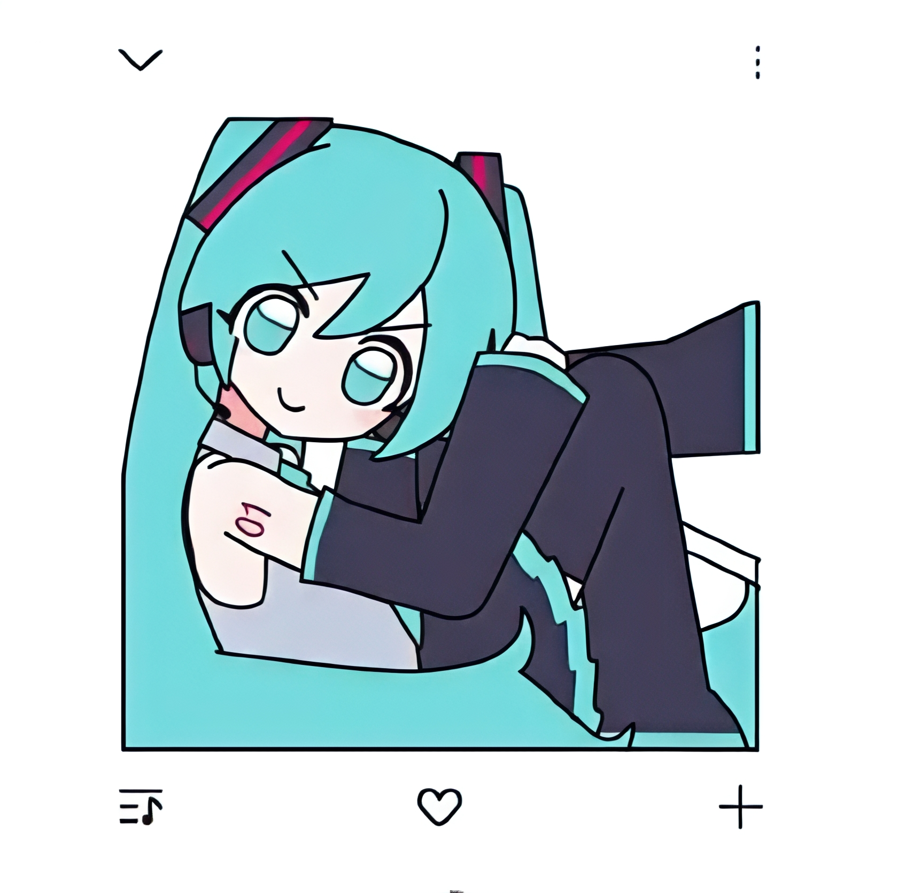

# 简音

<div align="center">

{: width="200" height="200"}

**一个基于 Meting API 的现代化音乐播放器**

[](https://android-arsenal.com/api?level=21)
[](https://kotlinlang.org)
[](LICENSE)
[](https://github.com/qianqianhhh2/jianyin/stargazers)
[](https://github.com/qianqianhhh2/jianyin/network/members)

[下载 APK](https://github.com/qianqianhhh2/jianyin/releases) · [报告 Bug](https://github.com/qianqianhhh2/jianyin/issues) · [功能建议](https://github.com/qianqianhhh2/jianyin/issues)

</div>

***

## 项目简介

简音是一款使用 Kotlin 和 Jetpack Compose 开发的现代化 Android 音乐播放器，基于 Meting API 提供音乐服务。采用 MVVM 架构，结合 Material Design 3 设计规范，为用户提供流畅、美观的音乐体验。

## 核心特性

- 多平台音乐支持 - 集成网易云、QQ音乐等主流音乐平台
- 现代化 UI - 基于 Material Design 3 和 Jetpack Compose
- 后台播放 - 支持锁屏控制和通知栏控制
- 播放列表管理 - 创建、编辑、同步播放列表
- 音乐下载 - 支持离线播放
- 毛玻璃效果 - 精美的视觉效果
- 深色模式 - 完整的深色主题支持
- 数据备份 - 支持播放列表和设置备份

## 技术栈

### 核心框架

- **Kotlin** - 现代化编程语言
- **Jetpack Compose** - 声明式 UI 框架
- **Material Design 3** - Google 最新设计系统

### 架构模式

- **MVVM** - Model-View-ViewModel 架构
- **Repository** - 数据仓库模式
- **DataStore** - 数据持久化

### 核心库

- **Media3 ExoPlayer** - 媒体播放引擎
- **MediaSession** - 媒体会话管理
- **Retrofit** - 网络请求
- **Gson** - JSON 解析
- **OkHttp** - HTTP 客户端
- **Coil** - 图片加载

### UI 效果

- **Cloudy** - 毛玻璃模糊效果
- **Material You** - 动态取色

## 项目结构

```
jianyin/
├── app/
│   └── src/main/
│       ├── kotlin/com/qian/jianyin/
│       │   ├── MainActivity.kt              # 主 Activity
│       │   ├── MusicViewModel.kt            # 音乐视图模型
│       │   ├── DataModels.kt                # 数据模型
│       │   ├── 播放器核心组件/
│       │   │   ├── MusicPlayerManager.kt    # 播放管理器
│       │   │   ├── PlaybackService.kt        # 后台服务
│       │   │   ├── MediaSessionManager.kt    # 会话管理
│       │   │   ├── PlayerHolder.kt           # 播放器持有者
│       │   │   └── PlaybackMode.kt           # 播放模式
│       │   ├── UI界面组件/
│       │   │   ├── HomeScreen.kt           # 主界面
│       │   │   ├── SearchScreen.kt         # 搜索界面
│       │   │   ├── MiniPlayer.kt           # 迷你播放器
│       │   │   ├── MyLibraryScreen.kt      # 我的音乐库
│       │   │   └── OnboardingScreen.kt     # 引导页
│       │   ├── 数据管理组件/
│       │   │   ├── DownloadManager.kt      # 下载管理
│       │   │   ├── PlaylistDataStore.kt    # 播放列表存储
│       │   │   ├── BackupManager.kt        # 备份管理
│       │   │   └── MusicStatsManager.kt     # 统计管理
│       │   ├── 系统服务组件/
│       │   │   ├── DaemonService.kt        # 守护服务
│       │   │   └── KeepAliveJobService.kt  # 保活服务
│       │   └── UI工具类/
│       │       ├── GlassmorphismUtils.kt    # 毛玻璃工具
│       │       └── MaterialUtils.kt         # Material 工具
│       └── res/                             # 资源文件
├── gradle/
│   └── libs.versions.toml                   # 依赖版本管理
├── build.gradle                            # 根构建配置
└── settings.gradle                         # 项目设置
```

## 快速开始

### 环境要求

- **Android Studio** - Hedgehog (2023.1.1) 或更高版本
- **Gradle** - 9.0 或更高版本
- **JDK** - 17 或更高版本
- **Android SDK** - API Level 21 或更高版本

### 克隆项目

```bash
git clone https://github.com/qianqianhhh2/jianyin.git
cd jianyin
```

### 构建项目

1. 使用 Android Studio 打开项目
2. 等待 Gradle 同步完成
3. 连接 Android 设备或启动模拟器
4. 点击 Run 按钮或使用快捷键 `Shift + F10`

### 命令行构建

```bash
# Debug 版本
./gradlew assembleDebug

# Release 版本
./gradlew assembleRelease

# 安装到设备
./gradlew installDebug
```

## 功能使用

### 播放音乐

- 在首页浏览推荐音乐
- 使用搜索功能查找歌曲
- 点击播放按钮开始播放
- 使用迷你播放器控制播放

### 管理播放列表

- 创建自定义播放列表
- 添加或删除歌曲
- 同步播放列表到云端

### 下载音乐

- 长按歌曲选择下载
- 在下载管理中查看进度
- 离线播放已下载音乐

### 备份数据

- 在设置中选择备份
- 选择备份内容（播放列表、设置等）
- 恢复数据时选择备份文件

## 开发指南

### 架构设计

项目采用 MVVM + Repository 架构：

- **View** - Jetpack Compose UI 组件
- **ViewModel** - 管理界面状态和业务逻辑
- **Repository** - 数据层抽象，统一数据来源
- **DataStore** - 本地数据持久化

### 代码规范

- 遵循 Kotlin 官方代码风格
- 使用 Material Design 3 组件
- 注释使用中文
- 函数命名使用驼峰命名法

### 提交规范

```
feat: 新功能
fix: 修复 bug
docs: 文档更新
style: 代码格式调整
refactor: 重构代码
test: 测试相关
chore: 构建/工具相关
```

## 贡献指南

欢迎贡献代码！请遵循以下步骤：

1. Fork 本仓库
2. 创建特性分支 (`git checkout -b feature/AmazingFeature`)
3. 提交更改 (`git commit -m 'feat: Add some AmazingFeature'`)
4. 推送到分支 (`git push origin feature/AmazingFeature`)
5. 创建 Pull Request

### 贡献者

暂无贡献者，当然你可以参与贡献。

## 作者

**谦谦TWT**

- Bilibili: [独角大盗取的](https://space.bilibili.com/)
- QQ交流群: 1082723263
- GitHub: [@qianqianhhh2](https://github.com/qianqianhhh2)

## 许可证

本项目采用 MIT 许可证 - 查看 [LICENSE](LICENSE) 文件了解详情

## 致谢

感谢以下开源项目：

### 核心框架

- [Jetpack Compose](https://developer.android.com/jetpack/compose) - 现代声明式 UI
- [Material Design 3](https://m3.material.io/) - Google 设计系统
- [AndroidX Media3](https://developer.android.com/media/media3) - 媒体播放框架
- [ExoPlayer](https://github.com/google/ExoPlayer) - 强大的媒体播放器

### 网络与数据

- [Retrofit](https://square.github.io/retrofit/) - 类型安全的 HTTP 客户端
- [Gson](https://github.com/google/gson) - JSON 序列化库
- [OkHttp](https://square.github.io/okhttp/) - 高效 HTTP 客户端

### UI 效果

- [Coil](https://coil-kt.github.io/coil/) - Kotlin 图片加载库
- [Cloudy](https://github.com/skydoves/Cloudy) - 毛玻璃模糊效果

### API 服务

- [Meting API](https://github.com/metowolf/Meting) - 音乐接口服务
- [祈杰のMeting-API](https://api.qijieya.cn/meting/) - 支持 VIP 解析

### 构建工具

- [Gradle](https://gradle.org/) - 构建自动化工具

## 联系方式

如有问题或建议，欢迎通过以下方式联系：

- 提交 [Issue](https://github.com/qianqianhhh2/jianyin/issues)
- 加入 QQ 群: 1082723263
- 发送邮件: [联系作者](mailto:)

***

<div align="center">

**如果这个项目对你有帮助，请给个 Star ⭐**

Made with ❤️ by 谦谦TWT

</div>