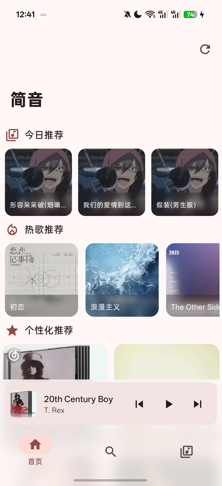
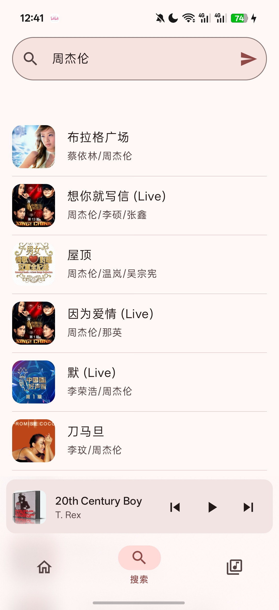
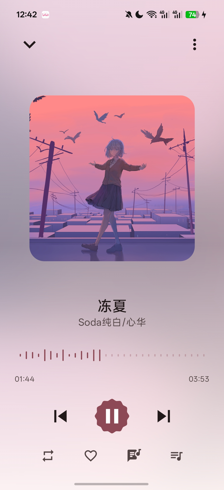
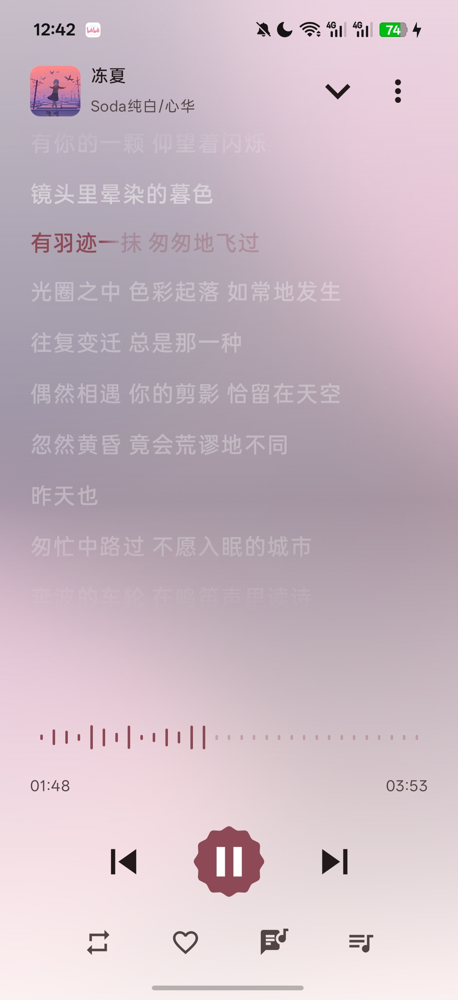
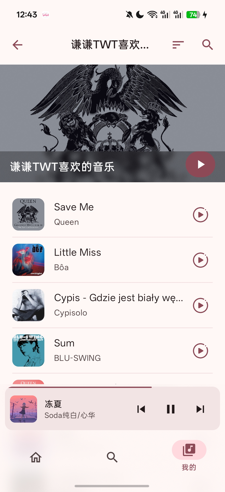
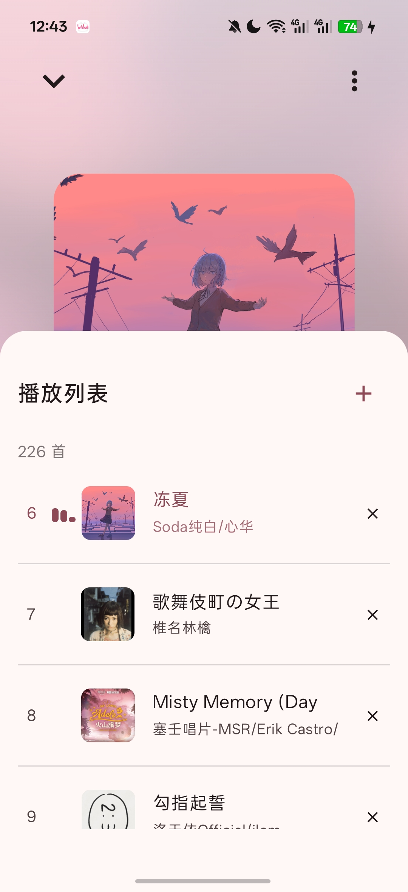
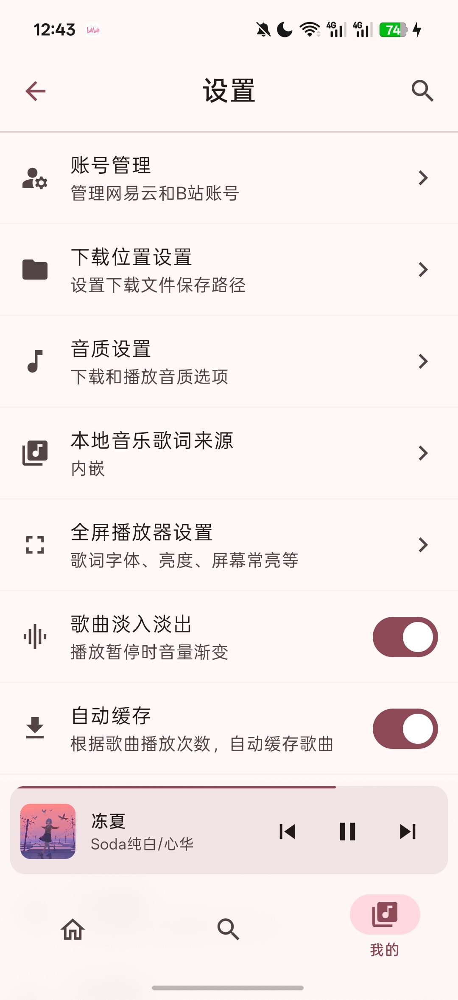

# 简音

<div align="center">


**一个现代化的多平台音乐播放器**

[](https://android-arsenal.com/api?level=30)
[](https://kotlinlang.org)
[](LICENSE)
[](https://github.com/qianqianhhh2/jianyin/stargazers)
[](https://github.com/qianqianhhh2/jianyin/network/members)

[下载 APK](https://github.com/qianqianhhh2/jianyin/releases) · [报告 Bug](https://github.com/qianqianhhh2/jianyin/issues) · [功能建议](https://github.com/qianqianhhh2/jianyin/issues)

</div>

***

## 项目简介

简音是一款使用 Kotlin 和 Jetpack Compose 开发的现代化 Android 音乐播放器。采用 MVVM 架构，结合 Material Design 3 设计规范，为用户提供流畅、美观的音乐体验。

> **重要声明**：出于项目存活考虑，本项目已不再依赖 Meting API，现已独立实现网易云和 Bilibili 的音乐接口。

## 应用截图

<div align="center">

| 首页 | 搜索 | 播放器 | 歌词 |
|:---:|:---:|:---:|:---:|
|  |  |  |  |

| 音乐库 | 播放列表 | 设置 |
|:---:|:---:|:---:|
|  |  |  |

</div>

## 核心特性

- **多平台音乐支持** - 集成网易云音乐、Bilibili、本地音乐多平台播放
- **现代化 UI** - 基于 Material Design 3 和 Jetpack Compose
- **动态取色 (Material You)** - 基于 MaterialKolor 的动态主题配色
- **后台播放** - 支持锁屏控制、通知栏控制和媒体会话
- **播放列表管理** - 创建、编辑、同步播放列表（支持 Bilibili 收藏夹同步）
- **音乐下载与导入** - 支持在线下载和本地文件导入
- **毛玻璃效果 (Haze)** - 精美的模糊视觉效果
- **深色模式** - 完整的深色/浅色主题支持，支持跟随系统
- **桌面歌词** - 悬浮桌面歌词服务
- **数据备份与恢复** - 支持播放列表和设置的备份还原
- **引导页** - 首次启动引导，含彩纸 (Konfetti) 粒子特效
- **里程碑弹窗** - 连续启动 1 天/7 天/30 天/365 天的庆祝提示
- **用户统计** - 追踪播放次数、连续启动天数、常听时段
- **一言 (Hitokoto)** - 首页一言展示
- **Bilibili 网页登录** - 支持 B 站账号登录获取高清音源
- **网易云网页登录** - 支持网易云账号登录

## 技术栈

### 开发语言

- **Kotlin 2.1.0** - 现代化 Android 开发语言

### 核心框架

- **Jetpack Compose** - 声明式 UI 框架
  - `androidx.compose.material3:material3:1.3.0`
  - `androidx.compose.ui:ui:1.7.0`
  - `androidx.compose.material:material-icons-extended:1.7.0`
- **AndroidX Activity Compose** - `androidx.activity:activity-compose:1.10.1`
- **AndroidX Navigation Compose** - `androidx.navigation:navigation-compose:2.7.0`
- **AndroidX Lifecycle ViewModel Compose** - `androidx.lifecycle:lifecycle-viewmodel-compose:2.7.0`

### 架构模式

- **MVVM** - Model-View-ViewModel 架构
- **Repository** - 数据仓库模式
- **DataStore** - 数据持久化 (`androidx.datastore:datastore-preferences:1.0.0`)

### 媒体播放

- **Media3 ExoPlayer** - `androidx.media3:media3-exoplayer:1.3.0` 媒体播放引擎
- **Media3 Session** - `androidx.media3:media3-session:1.3.0` 媒体会话管理
- **Media3 UI** - `androidx.media3:media3-ui:1.3.0` 播放器 UI 组件
- **AndroidX Media** - `androidx.media:media:1.7.0`

### 网络与数据

- **Retrofit 2.9.0** - 类型安全的 HTTP 客户端
  - `com.squareup.retrofit2:retrofit:2.9.0`
  - `com.squareup.retrofit2:converter-gson:2.9.0`
  - `com.squareup.retrofit2:converter-scalars:2.9.0`
- **OkHttp 4.12.0** - `com.squareup.okhttp3:okhttp:4.12.0` 高效 HTTP 客户端
- **Gson 2.10.1** - `com.google.code.gson:gson:2.10.1` JSON 序列化/反序列化
- **JSON 20231013** - `org.json:json:20231013` JSON 处理

### 图片加载

- **Coil 2.5.0** - Kotlin 优先的图片加载库
  - `io.coil-kt:coil-compose:2.5.0` Compose 集成
  - `io.coil-kt:coil-gif:2.5.0` GIF 支持

### UI 效果

- **Haze 1.7.2** - `dev.chrisbanes.haze:haze:1.7.2` 毛玻璃模糊效果
  - `dev.chrisbanes.haze:haze-materials:1.7.2` Material 风格模糊效果
- **Konfetti 2.0.2** - `nl.dionsegijn:konfetti-compose:2.0.2` 彩纸/粒子庆祝动画
- **Palette** - `androidx.palette:palette-ktx:1.0.0` 图片取色
- **MaterialKolor 3.0.1** - `com.materialkolor:material-kolor:3.0.1` Material You 动态配色生成

### 后台任务

- **WorkManager 2.9.0** - `androidx.work:work-runtime-ktx:2.9.0` 后台保活与定时任务

### 协程

- **Kotlin Coroutines 1.7.3** - `org.jetbrains.kotlinx:kotlinx-coroutines-android:1.7.3` 异步编程

### 安全

- **AndroidX Security** - `androidx.security:security-crypto:1.1.0-alpha06` 安全加密存储

### 崩溃报告

- **Bugly CrashReport** - `com.tencent.bugly:crashreport` 腾讯 Bugly 崩溃收集

### 权限处理

- **Accompanist Permissions** - `com.google.accompanist:accompanist-permissions:0.35.1-alpha` Compose 权限处理

### 音频数据处理

- **JAudiotagger 2.2.7** - `com.github.goxr3plus:jaudiotagger:2.2.7` 音频文件元数据读取
- **TagLib 1.0.5** - `io.github.kyant0:taglib:1.0.5` 音频标签写入

### Brotli 解压

- **Brotli Dec 0.1.2** - `org.brotli:dec:0.1.2` Brotli 压缩算法解码（网易云 API 数据解密）

### 基础 AndroidX 库

- **AndroidX Core KTX** - `androidx.core:core-ktx:1.17.0`
- **AndroidX AppCompat** - `androidx.appcompat:appcompat:1.7.1`
- **Material** - `com.google.android.material:material:1.13.0`

### 构建工具

- **Gradle 9.0+** - 构建自动化
- **AGP 8.13.0** - Android Gradle Plugin
- **Kotlin Compose Plugin** - `org.jetbrains.kotlin.plugin.compose`

## 项目结构

```
jianyin/
├── app/                                          # 主应用模块
│   ├── src/main/
│   │   ├── kotlin/com/qian/jianyin/
│   │   │   ├── bili/                             # B站相关
│   │   │   │   ├── BiliPlayerHelper.kt           # B站播放器助手
│   │   │   │   └── LocalMusicManager.kt          # 本地音乐管理
│   │   │   ├── data/                             # 数据层
│   │   │   │   ├── local/                        # 本地持久化存储
│   │   │   │   │   ├── DownloadSettingsStore.kt  # 下载设置存储
│   │   │   │   │   ├── PlaybackStateStore.kt     # 播放状态存储
│   │   │   │   │   ├── PlaylistDataStore.kt      # 播放列表存储
│   │   │   │   │   └── SongCustomDataStore.kt    # 歌曲自定义数据存储
│   │   │   │   └── model/                        # 数据模型
│   │   │   │       ├── DataModels.kt             # 通用数据模型
│   │   │   │       └── PlaylistItemV6.kt         # 播放列表项模型
│   │   │   ├── download/                         # 下载模块
│   │   │   │   ├── DownloadManager.kt            # 下载管理器
│   │   │   │   ├── DownloadProgressDialog.kt     # 下载进度弹窗
│   │   │   │   ├── DownloadStateManager.kt       # 下载状态管理器
│   │   │   │   ├── ImportProgressDialog.kt       # 导入进度弹窗
│   │   │   │   └── ImportStateManager.kt         # 导入状态管理器
│   │   │   ├── misc/                             # 杂项工具
│   │   │   │   ├── BackupManager.kt              # 数据备份管理器
│   │   │   │   ├── MusicStatsManager.kt          # 音乐统计管理器
│   │   │   │   └── UserStatsManager.kt           # 用户统计管理器（启动天数/常听时段）
│   │   │   ├── playback/                         # 播放模块
│   │   │   │   ├── BluetoothDisconnectReceiver.kt # 蓝牙断开广播接收器
│   │   │   │   ├── DesktopLyricService.kt        # 桌面歌词悬浮窗服务
│   │   │   │   ├── MediaSessionManager.kt        # 媒体会话管理器
│   │   │   │   ├── MusicPlayerManager.kt         # 音乐播放器核心管理器
│   │   │   │   ├── PlaybackMode.kt               # 播放模式定义
│   │   │   │   ├── PlaybackService.kt            # 后台播放服务
│   │   │   │   └── PlayerHolder.kt               # 播放器持有者
│   │   │   ├── sync/                             # 同步模块
│   │   │   │   ├── BiliPlaylistSyncManager.kt    # B站收藏夹同步管理器
│   │   │   │   └── PlaylistSyncManager.kt        # 播放列表同步管理器
│   │   │   ├── ui/                               # UI 层
│   │   │   │   ├── shapes/
│   │   │   │   │   └── MaterialStarShape.kt      # Material 风格星形组件
│   │   │   │   ├── BiliWebLoginActivity.kt       # B站网页登录页
│   │   │   │   ├── HomeScreen.kt                 # 首页
│   │   │   │   ├── LyricReveal.kt                # 歌词逐字显示组件（含光晕动画）
│   │   │   │   ├── MainActivity.kt               # 主 Activity（应用入口）
│   │   │   │   ├── MiniPlayer.kt                 # 迷你播放器组件
│   │   │   │   ├── MyLibraryScreen.kt            # 音乐库页面
│   │   │   │   ├── MyMusicScreenV2.kt            # 我的音乐页面 V2
│   │   │   │   ├── OnboardingScreen.kt           # 引导页（含 Konfetti 彩纸特效）
│   │   │   │   ├── SearchScreen.kt               # 搜索页面
│   │   │   │   ├── Theme.kt                      # 主题定义
│   │   │   │   └── ThemeColorUtil.kt             # 主题颜色工具
│   │   │   ├── utils/                            # 工具类
│   │   │   │   ├── HitokotoManager.kt            # 一言管理器
│   │   │   │   ├── MaterialUtils.kt              # Material 工具
│   │   │   │   └── PermissionManager.kt          # 权限管理器
│   │   │   ├── viewmodel/                        # 视图模型
│   │   │   │   ├── HomeScreenViewModel.kt        # 首页视图模型
│   │   │   │   └── MusicViewModel.kt             # 音乐播放视图模型
│   │   │   ├── worker/                           # 后台任务
│   │   │   │   ├── FirstDayDialog.kt             # 里程碑庆祝弹窗（通用，带 Konfetti 特效）
│   │   │   │   ├── KeepAliveWorker.kt            # 保活 Worker
│   │   │   │   ├── VersionChecker.kt             # 版本检查器
│   │   │   │   └── VersionUpdateDialog.kt        # 版本更新弹窗
│   │   │   ├── CacheManager.kt                   # 缓存管理器
│   │   │   ├── ImageBrightnessAnalyzer.kt        # 图片亮度分析器
│   │   │   ├── JianYinApplication.kt             # Application 类
│   │   │   └── PlaybackSettingsStore.kt          # 播放设置存储
│   │   ├── res/                                  # 资源文件
│   │   │   ├── drawable/                         # 图片/矢量图资源
│   │   │   ├── drawable-v24/                     # API 24+ 矢量图
│   │   │   ├── mipmap-*/                         # 启动图标 (各分辨率)
│   │   │   ├── values/                           # 颜色/字符串/主题定义
│   │   │   ├── values-night/                     # 深色模式颜色/主题
│   │   │   └── xml/                              # XML 配置 (备份规则等)
│   │   └── AndroidManifest.xml                   # 应用清单文件
│   ├── build.gradle                              # 应用模块构建配置
│   └── proguard-rules.pro                        # 混淆规则
│
├── bili-api/                                     # Bilibili API 模块
│   ├── src/main/java/com/qian/jianyin/bili/
│   │   ├── data/
│   │   │   ├── auth/
│   │   │   │   └── BiliCookieRepository.kt       # B站 Cookie 持久化仓库
│   │   │   └── platform/
│   │   │       └── BiliAudioSelector.kt          # B站音质选择器
│   │   ├── util/
│   │   │   └── BiliLogger.kt                     # B站日志工具
│   │   ├── BiliApiHelper.kt                      # B站 API 核心助手
│   │   └── BiliWebLoginHelper.kt                 # B站网页登录助手
│   ├── build.gradle.kts                          # B站模块构建配置
│   ├── consumer-rules.pro                        # 消费者混淆规则
│   └── README.md
│
├── netease-api/                                  # 网易云音乐 API 模块
│   ├── src/main/java/com/qian/jianyin/netease/
│   │   ├── api/
│   │   │   ├── NeteaseApiService.kt              # 网易云 API 服务定义
│   │   │   └── NeteaseClient.kt                  # 网易云 API 客户端
│   │   ├── auth/
│   │   │   ├── NeteaseAuthHeuristics.kt          # 网易云认证启发式算法
│   │   │   └── WebLoginCompletionWatcher.kt      # 网页登录完成监听器
│   │   ├── data/
│   │   │   └── auth/
│   │   │       └── NeteaseCookieRepository.kt    # 网易云 Cookie 持久化仓库
│   │   ├── CryptoMode.kt                         # 加密模式枚举
│   │   ├── JsonUtil.kt                           # JSON 工具类
│   │   ├── NeteaseCrypto.kt                      # 网易云请求加密/解密
│   │   ├── NeteaseModels.kt                      # 网易云数据模型
│   │   └── NeteaseWebLoginActivity.kt            # 网易云网页登录页
│   ├── build.gradle.kts                          # 网易云模块构建配置
│   └── AndroidManifest.xml
│
├── gradle/                                       # Gradle 配置
│   ├── wrapper/
│   │   ├── gradle-wrapper.jar
│   │   └── gradle-wrapper.properties
│   └── libs.versions.toml                        # 版本目录（统一依赖管理）
│
├── images/                                       # 文档用图片
│   └── logo.png
│
├── .gitignore
├── build.gradle                                  # 根项目构建配置
├── gradle.properties                             # Gradle 属性
├── gradlew / gradlew.bat                         # Gradle Wrapper 脚本
├── LICENSE                                       # 开源许可证 (GPL-3.0)
├── settings.gradle                               # 项目设置（模块声明）
└── README.md                                     # 项目说明文档
```

## 快速开始

### 环境要求

- **Android Studio** - Hedgehog (2023.1.1) 或更高版本
- **Gradle** - 9.0 或更高版本
- **JDK** - 17 或更高版本
- **Android SDK** - API Level 30 或更高版本 (compileSdk 36)

### 克隆项目

```bash
git clone https://github.com/qianqianhhh2/jianyin.git
cd jianyin
```

### 构建项目

1. 使用 Android Studio 打开项目
2. 等待 Gradle 同步完成
3. 连接 Android 设备或启动模拟器
4. 点击 Run 按钮或使用快捷键 `Shift + F10`

> **注意！** 你需要手动配置签名，否则 release 构建会报错。

### 命令行构建

```bash
# Debug 版本
./gradlew assembleDebug

# Release 版本
./gradlew assembleRelease

# 安装到设备
./gradlew installDebug
```

### 项目模块说明

| 模块 | 说明 |
|------|------|
| `app` | 主应用模块，包含 UI、播放器、下载管理、数据存储等 |
| `bili-api` | Bilibili API 封装模块，提供 B 站音频搜索、播放、登录等功能 |
| `netease-api` | 网易云音乐 API 封装模块，提供网易云搜索、播放、登录等功能 |

## 功能使用

### 播放音乐

- 在首页浏览推荐音乐
- 使用搜索功能查找歌曲
- 点击播放按钮开始播放
- 使用迷你播放器控制播放
- 支持 Bilibili 分 P 视频音频播放

### 管理播放列表

- 创建自定义播放列表
- 添加或删除歌曲
- 同步 Bilibili 收藏夹到本地播放列表
- 播放列表云端同步

### 下载音乐

- 长按歌曲选择下载
- 在下载管理中查看进度
- 离线播放已下载音乐

### 导入本地音乐

- 支持从本地文件导入音乐
- 自动读取音频文件元数据（标题、艺术家、专辑封面）

### 备份数据

- 在设置中选择备份
- 选择备份内容（播放列表、设置等）
- 恢复数据时选择备份文件

### 主题设置

- 支持浅色/深色模式切换
- 支持跟随系统主题
- 支持 Material You 动态取色（根据壁纸生成主题色）
- 支持自定义种子色

## 开发指南

### 架构设计

项目采用 MVVM + Repository 架构：

```
┌─────────────────────────────────────────┐
│                  UI Layer               │
│  ┌───────────────────────────────────┐  │
│  │  Jetpack Compose UI Components    │  │
│  │  (HomeScreen, SearchScreen, etc.) │  │
│  └──────────────┬────────────────────┘  │
│                 │ observes              │
│  ┌──────────────▼────────────────────┐  │
│  │  ViewModel                        │  │
│  │  (MusicViewModel,                 │  │
│  │   HomeScreenViewModel)            │  │
│  └──────────────┬────────────────────┘  │
│                 │ calls                 │
├─────────────────┼───────────────────────┤
│            Data Layer                   │
│  ┌──────────────▼────────────────────┐  │
│  │  Repository / Manager             │  │
│  │  (DownloadManager,                │  │
│  │   MusicPlayerManager,             │  │
│  │   PlaylistSyncManager)            │  │
│  └──────────────┬────────────────────┘  │
│                 │                       │
│  ┌──────────────▼────────────────────┐  │
│  │  DataStore / SharedPreferences    │  │
│  │  (PlaylistDataStore,              │  │
│  │   DownloadSettingsStore,          │  │
│  │   PlaybackStateStore)             │  │
│  └───────────────────────────────────┘  │
└─────────────────────────────────────────┘
```

- **View** - Jetpack Compose UI 组件，声明式 UI 渲染
- **ViewModel** - 管理界面状态和业务逻辑，通过 StateFlow 暴露数据
- **Repository / Manager** - 数据层抽象，统一管理网络请求、本地存储、播放控制
- **DataStore** - 基于 Preferences DataStore 的本地数据持久化

### 代码规范

- 遵循 Kotlin 官方代码风格
- 使用 Material Design 3 组件
- 注释使用中文
- 函数命名使用驼峰命名法

### 提交规范

```
feat: 新功能
fix: 修复 bug
docs: 文档更新
style: 代码格式调整
refactor: 重构代码
test: 测试相关
chore: 构建/工具相关
```

## 贡献指南

欢迎贡献代码！请遵循以下步骤：

1. Fork 本仓库
2. 创建特性分支 (`git checkout -b feature/AmazingFeature`)
3. 提交更改 (`git commit -m 'feat: Add some AmazingFeature'`)
4. 推送到分支 (`git push origin feature/AmazingFeature`)
5. 创建 Pull Request

### 贡献者
小威- GitHub: [@power690](https://github.com/power690)

## 作者

**谦谦TWT**

- Bilibili: [独角大盗取的](https://space.bilibili.com/)
- QQ交流群: 1082723263
- GitHub: [@qianqianhhh2](https://github.com/qianqianhhh2)

## 许可证

本项目采用 GPL-3.0 许可证 - 查看 [LICENSE](LICENSE) 文件了解详情

## 致谢

感谢以下开源项目：

### 核心框架

- [Jetpack Compose](https://developer.android.com/jetpack/compose) - 现代声明式 UI 框架
- [Material Design 3](https://m3.material.io/) - Google 最新设计系统
- [AndroidX Media3](https://developer.android.com/media/media3) - 媒体播放框架
- [ExoPlayer](https://github.com/google/ExoPlayer) - 强大的媒体播放器

### 网络与数据

- [Retrofit](https://square.github.io/retrofit/) - 类型安全的 HTTP 客户端
- [Gson](https://github.com/google/gson) - JSON 序列化/反序列化库
- [OkHttp](https://square.github.io/okhttp/) - 高效 HTTP 客户端
- [JSON-java](https://github.com/stleary/JSON-java) - JSON 处理库

### 图片处理

- [Coil](https://coil-kt.github.io/coil/) - Kotlin 图片加载库，支持 GIF

### UI 效果

- [Haze](https://github.com/chrisbanes/haze) - Compose 毛玻璃模糊效果库
- [Konfetti](https://github.com/DionSegijn/Konfetti) - Compose 纸屑/彩纸粒子动画
- [MaterialKolor](https://github.com/jordond/MaterialKolor) - Material You 动态取色库

### 权限处理

- [Accompanist Permissions](https://github.com/google/accompanist) - Compose 权限处理库

### 音频数据处理

- [JAudiotagger](https://github.com/ijabz/jaudiotagger) - 音频文件元数据读取库
- [TagLib](https://github.com/kyant0/taglib) - 音频标签写入库

### 协程

- [Kotlin Coroutines](https://github.com/Kotlin/kotlinx.coroutines) - 异步编程库

### 安全

- [AndroidX Security](https://developer.android.com/jetpack/androidx/releases/security) - 安全加密存储库

### 后台任务

- [WorkManager](https://developer.android.com/topic/libraries/architecture/workmanager) - 后台任务调度

### API 服务

- **网易云音乐 API** - 独立实现，支持搜索、播放、歌单、歌词、登录等功能
- **Bilibili API** - 独立实现，支持音频搜索、播放、收藏夹同步、登录等功能

### 构建工具

- [Gradle](https://gradle.org/) - 构建自动化工具

### 参考项目

- [NeriPlayer](https://github.com/cwuom/NeriPlayer) - 多平台音视频聚合流媒体播放器，本项目 API 实现参考了该项目
- [ImageToolbox](https://github.com/T8RIN/ImageToolbox) - 彩纸特效 (Konfetti) 实现参考

## 联系方式

如有问题或建议，欢迎通过以下方式联系：

- 提交 [Issue](https://github.com/qianqianhhh2/jianyin/issues)
- 加入 QQ 群: 1082723263
- 发送邮件: [联系作者](mailto:2362813794@qq.com)

***

<div align="center">

**如果这个项目对你有帮助，请给个 Star ⭐**

Made with ❤️ by 谦谦TWT

</div>
